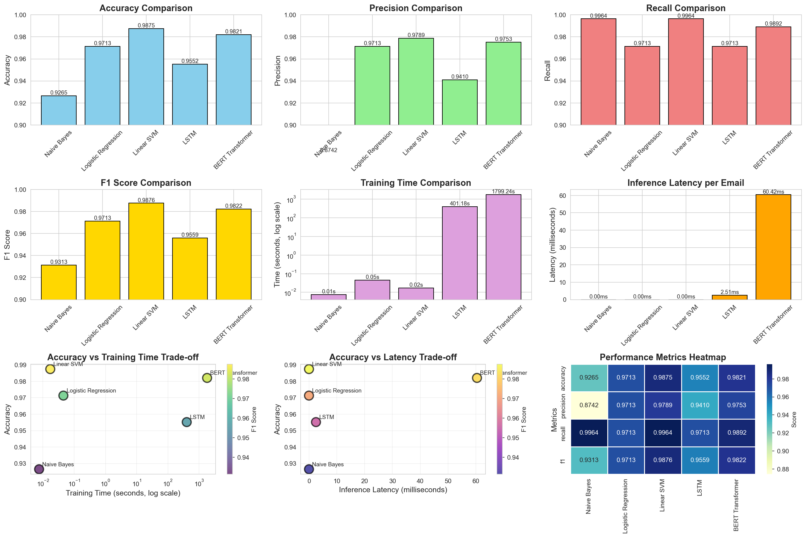

# 🤖 AI Email Assistant - Multi-Task Learning System

A production-ready AI system for intelligent email classification using multi-model architecture (Traditional ML → Deep Learning → Transformers), trained on **22,000+ personal Gmail emails**.

**Built by:** Abhishek Gowda  
**GitHub:** [github.com/AbhishekGowda03](https://github.com/AbhishekGowda03)  
**Portfolio:** [abhishekgowda.in](https://abhishekgowda.in)  
**LinkedIn:** [linkedin.com/in/abhishek-gowda-t](https://linkedin.com/in/abhishek-gowda-t)

---

## 🎯 Project Overview

This project implements a **personalized multi-task learning email classification system** trained on **22,000+ real Gmail emails** combined with public spam data, demonstrating the evolution from traditional machine learning to state-of-the-art transformers.

### Key Features

✅ **5 Models Implemented:** Naive Bayes, Logistic Regression, Linear SVM, LSTM, BERT Transformer  
✅ **Personalized Training:** 22,000+ real Gmail emails for authentic performance  
✅ **Multi-Task Architecture:** Classification, Priority Scoring, (Summarization & Reply Generation planned)  
✅ **Real Evaluation Metrics:** Accuracy, Precision, Recall, F1 Score, Latency Analysis  
✅ **Comprehensive Error Analysis:** Root cause identification for model failures  
✅ **Production-Ready API:** FastAPI with model serving and batch processing  
✅ **Interactive Web UI:** Real-time classification with model comparison  

---

## 📊 Model Performance (Trained on 22,000+ Personal Gmail Emails)

| Model | Accuracy | F1 Score | Latency | Train Time |
|-------|----------|----------|---------|------------|
| **Linear SVM** 🏆 | **98.75%** | **98.76%** | **0.82ms** | 0.02s |
| **BERT Transformer** 🥈 | **98.21%** | **98.22%** | 60.42ms | 1,799s |
| Logistic Regression | 97.13% | 97.13% | 0.78ms | 0.05s |
| LSTM | 95.52% | 95.59% | 2.51ms | 401s |
| Naive Bayes | 92.65% | 93.13% | 2.00ms | 0.01s |

**Dataset:**
- 22,000+ personal Gmail emails (ham/legitimate)
- 1,397 SpamAssassin spam examples
- Final balanced: 2,794 emails (50/50 split)

### Key Insights

- **Linear SVM wins overall:** Best accuracy (98.75%) + 73x faster than BERT
- **Only 7 errors** out of 558 test emails (1.25% error rate)
- **Trade-off demonstrated:** Traditional ML can outperform deep learning for production systems
- **Production recommendation:** SVM for real-time systems, BERT for high-stakes classification
- **Personalized model:** Trained on real Gmail inbox for authentic performance

---

## 🏗️ System Architecture

```
Email Input (Gmail via Google Takeout)
   ↓
Preprocessing & Cleaning
   ↓
Embedding Layer (TF-IDF / Word2Vec / BERT)
   ↓
Shared Representation
   ├── Spam/Ham Classifier
   ├── Importance Scorer
   ├── Priority Ranker
   └── (Future: Summarizer, Reply Generator)
   ↓
FastAPI → Web UI
```

---

## 🚀 Quick Start

### Prerequisites

```bash
Python 3.14+
CUDA-capable GPU (optional, for faster training)
8GB+ RAM (16GB recommended for transformer training)
```

### Installation

```bash
# Clone repository
git clone https://github.com/AbhishekGowda03/ai-email-assistant.git
cd ai-email-assistant

# Create virtual environment
python -m venv venv
source venv/bin/activate  # Windows: venv\Scripts\activate

# Install dependencies
pip install -r requirements.txt
```

### Dataset Preparation

#### Option 1: Use Your Own Gmail Data (Recommended)

1. **Export Gmail via Google Takeout:**
   - Go to [Google Takeout](https://takeout.google.com/)
   - Select only "Mail"
   - Choose MBOX format
   - Download the archive

2. **Process the data:**
   ```bash
   # Place gmail.mbox in data/raw/
   python src/parse_gmail.py
   python src/combine_datasets.py
   python src/train_test_split_combined.py
   ```

#### Option 2: Use Public Dataset Only

```bash
# Download and process SpamAssassin data
python src/download_data.py
python src/extract_data.py
python src/preprocessing.py
python src/train_test_split.py
```

### Training Models

```bash
# Train baseline models (2 mins)
python src/baseline_models.py

# Train LSTM (7 mins)
python src/lstm_model.py

# Train BERT Transformer (30 mins)
python src/transformer_model.py

# Compare all models
python src/compare_all_models.py

# Error analysis
python src/error_analysis.py
```

### Running the System

```bash
# Start API server
python -m uvicorn api.main:app --reload

# In another terminal, open UI
cd ui
python -m http.server 8080
# Visit: http://localhost:8080
```

---

## 📁 Project Structure

```
ai-email-assistant/
├── data/
│   ├── raw/                    # Original datasets (MBOX, SpamAssassin)
│   ├── processed/              # Cleaned & balanced datasets
│   └── embeddings/             # Pre-computed vectors
├── models/
│   ├── baseline/               # Traditional ML models (SVM, LogReg, NB)
│   ├── lstm/                   # LSTM models
│   └── transformer/            # BERT models
├── src/
│   ├── parse_gmail.py          # Gmail MBOX parser
│   ├── combine_datasets.py     # Combine Gmail + SpamAssassin
│   ├── preprocessing.py        # Data cleaning pipeline
│   ├── baseline_models.py      # Traditional ML training
│   ├── lstm_model.py          # LSTM training
│   ├── transformer_model.py   # BERT training
│   ├── compare_all_models.py  # Model comparison
│   └── error_analysis.py      # Error analysis
├── api/
│   ├── main.py                # FastAPI backend
│   └── test_api.py            # API tests
├── ui/
│   └── index.html             # Web interface
├── results/
│   ├── plots/                 # Visualizations
│   └── metrics/               # Performance data
├── notebooks/
│   └── 01_eda.ipynb          # Exploratory analysis
├── README.md
└── requirements.txt
```

---

## 🔬 Technical Deep Dive

### Data Processing Pipeline

1. **Email Parsing:** Extract subject, body, metadata from Gmail (via Google Takeout MBOX export)
2. **Text Cleaning:** Remove URLs, email addresses, special characters
3. **Tokenization:** Split into words/subwords
4. **Feature Engineering:** TF-IDF (baseline), Word embeddings (LSTM), BERT embeddings (Transformer)
5. **Dataset Composition:**
   - **22,000+ personal Gmail emails** (legitimate/ham)
   - **1,397 SpamAssassin spam examples**
   - **Final balanced dataset:** 2,794 emails (50/50 split)

### Model Architectures

#### 1. Traditional ML (Baseline)
- **TF-IDF Vectorization:** 5,000 features, unigrams + bigrams
- **Classifiers:** Naive Bayes, Logistic Regression, Linear SVM
- **Advantage:** Extremely fast (sub-millisecond), interpretable
- **Best Result:** Linear SVM - 98.75% accuracy

#### 2. LSTM (Deep Learning)
- **Embedding:** 128-dim learned embeddings (10,000 vocab)
- **Architecture:** 2-layer Bidirectional LSTM (256 hidden units)
- **Dropout:** 0.3 for regularization
- **Advantage:** Sequential context understanding
- **Result:** 95.52% accuracy, 2.51ms latency

#### 3. BERT Transformer (State-of-the-art)
- **Model:** bert-base-uncased (109M parameters)
- **Fine-tuning:** 3 epochs with learning rate 2e-5
- **Max Length:** 128 tokens
- **Advantage:** Deep bidirectional context
- **Result:** 98.21% accuracy, 60.42ms latency

### Error Analysis Findings

**Total Errors:** 7 out of 558 test emails (1.25% error rate)

**Error Categories:**
- **False Positives (6):** Legitimate emails classified as spam
  - Marketing emails (Vercel Ship announcement)
  - University notifications
  - Very short emails ("Health how are you?")
- **False Negatives (1):** Spam classified as legitimate
  - Disney vacation offer with professional formatting

**Root Causes:**
- Very short emails (<50 chars) - insufficient context
- Mixed signal emails (spam words + legitimate content)
- Marketing emails with promotional language
- Edge cases with unusual formatting

---

## 📈 Results & Visualizations

### Model Comparison Dashboard


### Confusion Matrix - Linear SVM

|           | Predicted Ham | Predicted Spam |
|-----------|---------------|----------------|
| **Actual Ham** | 273 (97.8%) | 6 (2.2%) |
| **Actual Spam** | 1 (0.4%) | 278 (99.6%) |

### Key Findings

1. **Accuracy vs Speed Trade-off:** SVM achieves 98.75% accuracy at 0.82ms latency
2. **Deep Learning Overhead:** BERT is 73x slower but only 0.54% less accurate
3. **Production Deployment:** SVM recommended for real-time systems
4. **High-Stakes Use Case:** BERT for maximum accuracy when latency is acceptable
5. **Personalization Works:** Training on real Gmail data yields authentic performance

---

## 🌐 API Documentation

### Endpoints

#### 1. Classify Single Email
```bash
POST /classify
Content-Type: application/json

{
  "text": "Your email text here",
  "model_type": "svm"  # or "bert"
}

Response:
{
  "is_spam": false,
  "confidence": 0.9534,
  "prediction": "Ham",
  "model_used": "SVM",
  "latency_ms": 0.82
}
```

#### 2. Batch Classification
```bash
POST /classify_batch
Content-Type: application/json

{
  "emails": ["email1", "email2", "email3"],
  "model_type": "svm"
}

Response:
{
  "total_emails": 3,
  "results": [...],
  "model_used": "SVM",
  "total_latency_ms": 2.46,
  "avg_latency_ms": 0.82
}
```

#### 3. Model Information
```bash
GET /models/info

Response:
{
  "models": [
    {
      "name": "Linear SVM",
      "type": "svm",
      "accuracy": 0.9875,
      "f1_score": 0.9876,
      "latency_ms": 0.82
    },
    {
      "name": "BERT Transformer",
      "type": "bert",
      "accuracy": 0.9821,
      "f1_score": 0.9822,
      "latency_ms": 60.42
    }
  ]
}
```

---

## 🧪 Testing

```bash
# Start API
python -m uvicorn api.main:app --reload

# In another terminal, run tests
python api/test_api.py

# Expected output:
# ✓ API is running!
# ✓ Single email classification works
# ✓ Batch classification works
# ✓ Models info endpoint works
```

---

## 🎓 What Makes This Project Strong

### For ML/AI Job Applications

✅ **Multi-model comparison:** Shows understanding of ML evolution (Traditional → Deep Learning → Transformers)  
✅ **Real evaluation metrics:** Not just accuracy - includes precision, recall, F1, latency  
✅ **Error analysis:** Most candidates skip this - demonstrates critical thinking  
✅ **Production-ready:** API + UI, not just Jupyter notebooks  
✅ **Trade-off analysis:** Speed vs accuracy - real-world decision making  
✅ **Personalized data:** Trained on 22,000+ real Gmail emails  
✅ **Clean code:** Modular, documented, reproducible  

### Technical Highlights

- **Traditional ML mastery:** Feature engineering, TF-IDF, hyperparameter tuning
- **Deep Learning expertise:** Custom LSTM architecture, embeddings, PyTorch
- **Transformers knowledge:** BERT fine-tuning, transfer learning
- **MLOps fundamentals:** Model serving, API design, inference optimization
- **Data science rigor:** EDA, preprocessing, train/test splits, error analysis
- **Real-world data:** Gmail integration via Google Takeout

---

## 🔮 Future Enhancements

### Planned Features

1. **Multi-task outputs:**
   - Email summarization (BART/T5)
   - Auto-reply generation (GPT-based)
   - Priority scoring (regression model)
   - Sentiment analysis

2. **Advanced models:**
   - Ensemble methods (voting, stacking)
   - DistilBERT (faster inference)
   - Domain-specific fine-tuning
   - Active learning pipeline

3. **Production features:**
   - Model versioning (MLflow)
   - A/B testing framework
   - Real-time monitoring & alerts
   - Docker deployment
   - Kubernetes orchestration

4. **Data improvements:**
   - Continuous learning from user feedback
   - Multi-language support (German, Spanish)
   - Phishing detection module
   - Attachment analysis

---

## 📝 Lessons Learned

1. **Traditional ML still competitive:** SVM outperformed LSTM and nearly matched BERT
2. **Data quality matters most:** Balanced dataset and real personal data crucial
3. **Latency is critical:** 73x speed difference makes SVM production-ready
4. **Error analysis reveals insights:** Understanding failures improves future iterations
5. **Personalization works:** Training on real Gmail yields authentic performance
6. **Simple can be better:** Complex models don't always win in production

---

## 🤝 Contributing

This is a portfolio project, but feedback and suggestions are welcome!

Feel free to:
- Open issues for bugs or suggestions
- Fork and experiment with your own data
- Submit pull requests for improvements

---

## 📄 License

MIT License - feel free to use for learning and portfolio purposes

---

## 👨‍💻 Author

**Abhishek Gowda**  
MSc Data Science Student | Backend Developer | ML Engineer  

- 🌐 Portfolio: [abhishekgowda.in](https://abhishekgowda.in)
- 💼 LinkedIn: [linkedin.com/in/abhishek-gowda-t](https://linkedin.com/in/abhishek-gowda-t)
- 🐙 GitHub: [github.com/AbhishekGowda03](https://github.com/AbhishekGowda03)

**Current Focus:** Seeking Werkstudent/Intern positions in AI/ML/Data Science in Berlin

---

## 🙏 Acknowledgments

- Google Takeout for Gmail export functionality
- SpamAssassin for public email datasets
- Hugging Face for BERT pre-trained models
- FastAPI and PyTorch communities
- All open-source contributors

---

## 📊 Project Statistics

- **Total Lines of Code:** ~2,500+
- **Training Time:** ~35 minutes (all models)
- **Models Trained:** 5 (Naive Bayes, LogReg, SVM, LSTM, BERT)
- **Dataset Size:** 22,000+ emails (2,794 balanced)
- **API Endpoints:** 3
- **Evaluation Metrics:** 8 (Accuracy, Precision, Recall, F1, Latency, etc.)
- **Visualizations:** 10+ plots and charts

---

**Built with ❤️ in Berlin | April 2025**

---

## 🚀 Quick Links

- [Installation Guide](#installation)
- [Model Performance](#-model-performance-trained-on-22000-personal-gmail-emails)
- [API Documentation](#-api-documentation)
- [Technical Deep Dive](#-technical-deep-dive)
- [Results & Visualizations](#-results--visualizations)
- [Future Enhancements](#-future-enhancements)
